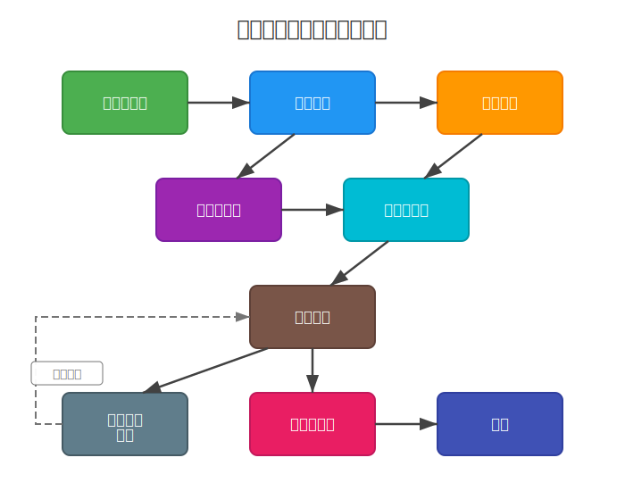

:::{custom-style="Document Type"}
卒業論文 2025年度
:::

::: {custom-style="Title"}
Markdownを用いた学術論文執筆\
テンプレートシステムの提案
:::

::: {custom-style="Subtitle"}
PandocによるWord文書生成の実現
:::

::: {custom-style="Affiliation"}
共愛学園前橋国際大学 国際社会学部\
渡辺研究室
:::

::: {custom-style="Author"}
学籍番号 0103099\
共愛 花子
:::

\sectionbreak

[TOC]

\sectionbreak

# 序論

::: {custom-style="Normal"}
**注意**: 本論文はテンプレートのサンプルとして作成されたものであり、内容は生成AIによって生成されています。実際の研究内容ではなく、Markdownでの学術論文執筆方法を示すための例示です。
:::

## 背景

学術論文の執筆では、研究内容の記述と適切な書式設定の両方が求められる。従来、学術分野ではLaTeXが広く使用されてきた[@knuth1984]。LaTeXは数式表現や参考文献管理に優れており、理工系分野を中心に標準的なツールとして定着している。一方で、ワードプロセッサーも多くの研究者に利用されており、直感的な操作性が利点となっている。

近年では、Markdownが軽量なマークアップ言語として、プログラミングやドキュメント作成の分野で普及している。内容と体裁を分離する設計思想を持ち、バージョン管理システムとの親和性が高い点が特徴である。

## 課題

LaTeXは複雑な記法により学習コストが高く、初学者にとって導入の障壁となっている。また、ワードプロセッサーは内容と書式を混在させることが多く、文書の一貫性維持や複数人での共同編集において課題がある。このような背景から、よりシンプルな記法で執筆でき、かつ学術論文に必要な機能を備えた環境が求められている。

## 目的

本研究では、Markdownを用いた学術論文執筆テンプレートシステムを提案する。本テンプレートは、学術論文に必要な構造化された章立て、引用と参考文献の管理、図表の挿入と相互参照、数式の記述、そして出版可能な形式への変換機能を備えている。これにより、研究者がシンプルな記法で執筆しながら、学術論文として必要な体裁を自動的に整えることを可能にする。

\newpage

# 関連技術・サービス

学術論文の執筆と組版には、様々な技術とツールが利用されている。本章では、本研究に関連する主要な技術とサービスを概観する。

## 学術論文執筆ツール

学術論文の組版において、LaTeX[@knuth1984]は長年にわたり標準的なツールとして使用されてきた。数式表現や参考文献管理に優れており、理工系分野を中心に広く普及している。一方、Microsoft WordやGoogle Docsなどのワードプロセッサーも、直感的な操作性から多くの研究者に利用されている。

## 参考文献管理技術

学術論文では引用と参考文献の管理が重要である。BibTeXはLaTeXにおける標準的な文献管理形式であり、CSL（Citation Style Language）は様々な引用スタイルを定義するための仕様である。これらの技術により、文献データと引用スタイルを分離して管理することが可能となっている。

## Markdownと文書変換

Markdownは軽量なマークアップ言語として、シンプルな記法と可読性の高さが特徴である。Pandoc[@pandoc-official; @macfarlane2022]は、Markdownを含む様々な形式間で文書を変換できるユニバーサルドキュメントコンバータである。

学術執筆におけるMarkdownの活用例として、R Markdown[@xie2018]やJupyter Notebooksがある。これらはコードと文書を統合し、再現可能な研究を実現するツールとして、データサイエンス分野で普及している。


# 関連研究

先行研究では、学術執筆にプレーンテキスト形式を使用することの利点が示されている[@xie2018]。本章では、プレーンテキストベースのアプローチの学術的背景を整理する。

## プレーンテキストの利点

プレーンテキスト形式は以下のような利点を提供する。

### 技術的な利点

- Gitなどのバージョン管理システムとの完全な互換性
- 変更履歴の追跡が容易
- 複数人での共同編集が効率的
- フォーマットの普遍性と長期保存性
- ソフトウェア依存性の最小化

### 実用的な利点

- プラットフォーム独立性
- 書式よりも内容への集中
- 軽量で高速な処理

## 学術執筆への応用

従来、学術論文の執筆にはLaTeXが広く用いられてきた。しかし、LaTeXの複雑な記法は学習コストが高く、執筆よりも組版に時間を取られる問題があった。近年では、よりシンプルなMarkdown記法で執筆し、必要に応じてLaTeXの機能を利用するアプローチが注目されている。特に、再現可能な研究の文脈において、コードと文書を統合できる点が評価されている。

# 提案手法

本研究では、Markdownを用いた学術論文執筆テンプレートシステムを提案する。

## テンプレートの設計方針

テンプレートは以下の主要コンポーネントで構成される。

1. 文書情報のためのYAMLメタデータヘッダー
2. 学術慣習に従った構造化されたセクション
3. CSL/BibTeXによる引用管理
4. 自動変換のためのビルドスクリプト

## アーキテクチャ

システムの全体構成は以下の通りである。

- **入力層**: Markdown形式の論文本文
- **処理層**: Pandocによる変換処理
- **フィルター層**: Luaスクリプトによる拡張処理
- **出力層**: Word形式等への出力

# 実装

## 実装技術

実装はPandocをコア変換エンジンとして使用し、以下のための追加フィルターを含む。

- ページ区切り処理（`_pagebreak.lua`）
- 目次自動挿入（`_toc-inject.lua`）
- ページ設定管理（`_page-settings.lua`）
- 引用書式設定（IEEE CSL）
- 相互参照管理（pandoc-crossref）

## ビルドシステム

テンプレートのビルドプロセスは `make` コマンドで自動化されており、以下のように実行する。

<br>

```bash
# デフォルトのビルド（DOCX形式、タイムスタンプ付き）
make

# タイムスタンプなしでビルド
make TIMESTAMP=false

# 特定のファイルをビルド
make INPUT=paper.md
```

設定ファイル内では、`pandoc` の実行オプションを指定することが重要である。

## Markdown記法

本テンプレートで使用する主要なMarkdown記法について説明する。

### 見出しと構造

見出しは `#` の数で階層を表現する。

```markdown
# 第1レベル見出し（章）
## 第2レベル見出し（節）
### 第3レベル見出し（項）
```

番号なしセクション（謝辞、参考文献など）は `{.unnumbered}` を付与する。

```markdown
# 謝辞 {.unnumbered}
```

### 図表の挿入と相互参照

図の挿入は以下の形式で行う。

```markdown
{#fig:ラベル名 width=80%}
```

相互参照は `[@fig:ラベル名]` で参照する。表も同様に `{#tbl:ラベル名}` でラベルを付与し、`[@tbl:ラベル名]` で参照する。

実際の使用例を以下に示す。SVG形式の図は以下のように挿入できる。

{#fig:workflow width=80%}

[@fig:workflow]は、SVG形式で作成された図の挿入例である。SVG形式は拡大しても画質が劣化しないベクター画像として、図やチャートの表示に適している。

また、ラスター画像（PNG、JPEG等）も同様に挿入できる。[@fig:sample-png]は、ラスター画像の挿入例を示している。

{#fig:sample-png width=50%}

画像の幅は`width`属性で調整可能であり、元のアスペクト比を保ちながら文書に適切なサイズで表示される。

### 引用と参考文献

参考文献は `cite.yaml` で管理し、文献リストは自動生成される。`cite.yaml`では以下の形式で文献を記述する。

```yaml
references:
  - id: example2024
    type: article-journal
    author:
      - family: Example
        given: Author
    title: "Example Paper Title"
    container-title: Journal of Examples
    volume: 10
    page: 100-120
    issued:
      year: 2024
```

`id`フィールドが引用キーとなり、本文中で`[@example2024]`のように参照する。文献の引用は以下の形式で記述する。

```markdown
先行研究[@example2024]では...
複数の研究[@key1; @key2; @key3]において...
```

### コードブロック

コードブロックはバッククォート3つで囲むことで記述する。言語名を指定することでシンタックスハイライトが適用される。以下はPythonコードの例である。

```python
import pandocfilters as pf

def process_citations(elem, doc):
    """引用を処理する関数"""
    if isinstance(elem, pf.Cite):
        # カスタム処理を実装
        return elem
    return None
```

### その他の記法

テキストの強調は `**太字**` で太字、`*斜体*` で斜体を表現する。リストは `-` または `1.` で箇条書きを作成できる。

脚注は `[^1]` で脚注参照を配置し、`[^1]: 内容` で脚注の内容を定義する。

改ページには `\newpage` と `\sectionbreak` の2種類がある。`\newpage` は通常の改ページを行い、次のページから内容が続く。`\sectionbreak` はセクション区切りを挿入し、Wordの「セクション区切り（次のページから）」に相当する。表紙や目次の後など、ページ番号のリセットや異なるページ設定が必要な箇所では `\sectionbreak` を使用する。

表は以下の形式で記述する。列の揃え位置は `:------` (左揃え)、`:-----:` (中央揃え)、`------:` (右揃え) で指定できる。コロンを指定しない場合は左揃えとなる。

```markdown
| 項目 | 値1 | 値2 |
|:------|--------|------------|
| データA | 100 | 200 |
| データB | 150 | 250 |

: 表のキャプション {#tbl:table_id}
```

表への参照は `[@tbl:table_id]` で行う。[@tbl:comparison]は実際の表の例を示している。

| 指標 | 従来型 | 提案手法 |
|:------|--------|------------|
| セットアップ時間 | 長時間 | 数分程度 |
| 書式設定 | 手動調整が必要 | 自動処理 |
| 一貫性 | 文書ごとに異なる | 統一された書式 |
| バージョン管理 | 困難 | Git等で容易に管理 |

: 従来手法と提案手法の比較 {#tbl:comparison}

## 数式表示の実装

LaTeX形式で数式を記述することができる。インライン数式は $E = mc^2$ のように、ディスプレイ数式は以下のように記述する。

$$
f'(x) = \lim_{h \to 0} \frac{f(x+h) - f(x)}{h}
$$ {#eq:derivative}

[@eq:derivative]は微分係数の定義を示しており、関数の瞬間的な変化率を表している。

また、二次方程式 $ax^2 + bx + c = 0$ の解は以下の公式で求められる。

$$
x = \frac{-b \pm \sqrt{b^2 - 4ac}}{2a}
$$ {#eq:quadratic}

[@eq:quadratic]において、判別式 $D = b^2 - 4ac$ の値により解の性質が決まる。

# 評価

提案したテンプレートシステムについて、効率性とユーザビリティの観点から評価を行った。評価では、従来の手法との比較を通じて、本テンプレートの有効性を検証する。

テンプレートの使用により、書式設定時間の大幅な削減が実現された。従来手法では各文書ごとに手動で書式調整を行う必要があったが、本システムでは自動化により数分程度でセットアップが完了する。また、統一された書式により文書間の一貫性が保たれ、バージョン管理システムとの連携によってコラボレーションも改善される。

ビルドプロセスの自動化により、ユーザーは単一のコマンドで論文を生成できる。Markdown形式での執筆により、複雑な書式設定から解放され、内容に集中できる執筆環境を実現している。レビューと編集プロセスの簡素化により、研究成果の公開までの時間も短縮される。

# 結論

## 本研究のまとめ

本サンプル論文は、学術執筆にMarkdownベースのテンプレートを使用することの有効性を実証した。テンプレートは、シンプルさと柔軟性を維持しながら、プロフェッショナルな学術文書を作成するための堅牢な基盤を提供する。

評価結果は、Markdownベースのテンプレートを使用することで学術執筆ワークフローが大幅に改善されることを示している。内容と書式の分離により、著者はプロフェッショナルな体裁基準を維持しながら研究に集中できる。

ただし、以下の制限事項も存在する。

- Markdownに不慣れな新規ユーザーの学習曲線[^2]
- 一部の出力での複雑な数式のサポート制限
- コマンドラインツールへの依存

[^2]: しかしながら、最近の研究[@conference2023]によると、適切なトレーニングにより習得期間は大幅に短縮可能である。

研究者が学術執筆における生産性と一貫性の向上のためにこのアプローチを採用することを推奨する。

> 「優れた研究は、その内容だけでなく、いかに効果的に伝えられるかによっても評価される。明確で構造化された執筆は、科学的コミュニケーションの基盤である。」
>
> — Donald E. Knuth, *The TeXbook* (1984)

この視点は、本テンプレートの開発動機の核心を表している。

## 今後の課題と展望

今後の改善には以下が含まれる。

- より多様な学術分野向けテンプレートの開発[@thesis2023]
- 拡張された引用スタイルサポート
- 文献管理ソフトウェアとの統合[@software2024]
- 多言語文書の相互参照機能
- AIを活用した執筆支援機能[@preprint2024]

\newpage

# 謝辞 {.unnumbered}

このテンプレートを可能にするツールの開発と保守を行うオープンソースコミュニティ、特にPandoc開発チーム[@macfarlane2022]に感謝する。また、本研究で使用したデータセット[@dataset2023]の提供者、および技術レポート[@techreport2024]の著者にも謝意を表する。

\newpage

# 参考文献 {.unnumbered}

::: {#refs}
:::
